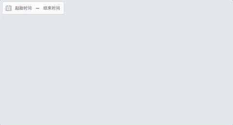

# react-dates

> **A React date picker component for thinkpage**

> 线上 DEMO: [thinkpage.github.io/react-dates](https://thinkpage.github.io/react-dates/)

> _forked from [airbnb/react-dates](https://github.com/airbnb/react-dates)_



## Live Playground

For examples of the datepicker in action, go to [thinkpage.github.io/react-dates](https://thinkpage.github.io/react-dates/)

OR

To run that demo on your own computer:

- Clone this repository
- `npm install`
- `npm run storybook`
- Visit [http://localhost:9001](http://localhost:9001/)

## 与 airbnb/react-dates 仓库的区别

- UI样式调整

  - Button 样式和 icon
  - Modal 阴影
  - 主色调

- 抽取更多的 css 变量

- 选择完日期之后 Modal 不会自动关闭，需点击"确定"

- 新增`onComplete`属性

- 改变数据传递逻辑，组件通过 state 保存日期变量

  - 单击 Modal 外侧可关闭 Modal，并复原选择的日期
  - 单击"确定"则调用`onComplete`回调，将改变的日期调用出去

- 快速选择时间段

  - 最近一个月

## 新增/改变 API 说明

> 原仓库 API 基本不变，使用文档可以参考 [airbnb/react-dates](https://github.com/airbnb/react-dates)

该仓库与 airbnb 仓库最大的不同是，组件会将初始化时的 startDate/endDate 作为 state 储存起来。之后，在 日期选择 Modal 开启的时候，改变的日期均为组件内部 state 的改变。之后当点击"确定"，才会将值回调出去；如果点击 Modal 外部关闭了 Modal，则复原 state，并不会触发 `onComplete` 方法

- `onComplete`: React.PropTypes.func

```javascript
// example
class ExampleComponent extends React.Component {
  constructor(props) {
    super(props);
    this.state = {
      startDate: null,
      endDate: null
    }
    this.onComplete = this.onComplete.bind(this);
  }

  onComplete({ startDate, endDate }) {
    this.setState({ startDate, endDate });
  }

  render() {
    const { startDate, endDate } = this.state;
    return (
      <DateRangePicker
        startDate={startDate}
        endDate={endDate}
        onComplete={this.onComplete}
      />
    )
  }
}

export default ExampleComponent;
```

- `keepOpenOnDateSelect`: React.PropTypes.bool

该属性代表点击日期之后 Modal 是否自动关闭。鉴于现在需要点击"确定"才能真正的改变日期，此属性已被设置为`true`
